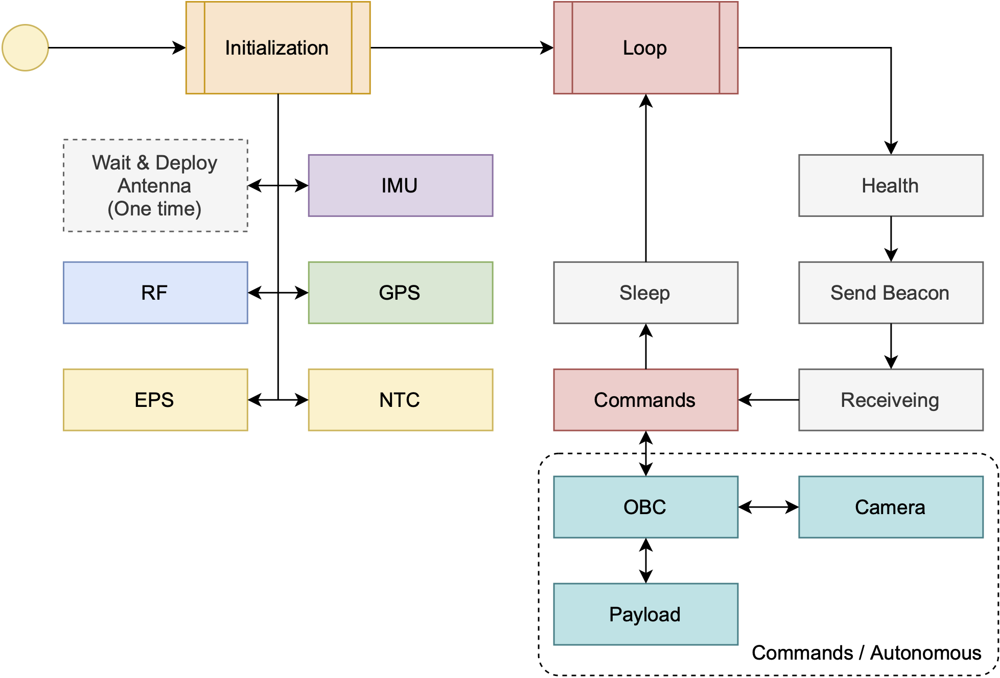
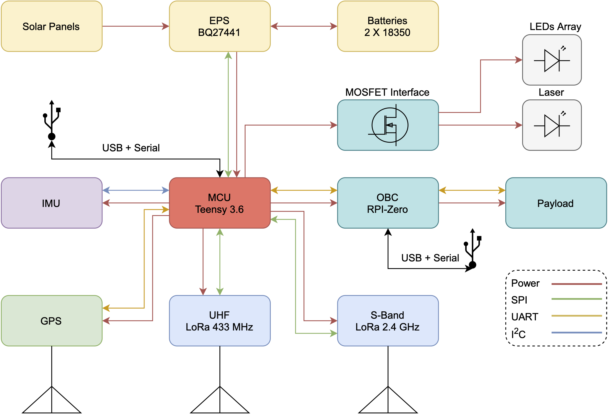

# Summary
Nanosatellites becoming a preferred platform for testing innovative technologies and conducting academic research in space. Flight Software (FSW) is a software program that operates on a processor embedded within the satellite structure [@miranda2019comparative]. It assumes the crucial responsibility of managing various aspects of satellite operations, including activity control, data processing, and ensuring satellite health and safety. By fulfilling these tasks, the FSW empowers the satellite to execute all actions essential for achieving its scientific objectives.

[SATLLA-0](https://github.com/kcglab/satllazero) is an open-source platform designed for academic institutions and school students to build and explore laboratory nanosatellites. It is based on the flight software utilized by the [SATLLA-2B](https://tinygs.com/satellite/SATLLA-2B) nanosatellite, which was developed and constructed by the Nanosatellite Research Laboratory of Ariel University. The successful launch of the SATLLA-2B nanosatellite took place on January 13, 2022, aboard a Falcon 9 launch vehicle. Since its launch, SATLLA-2B has been operating seamlessly, with its transmissions being received daily by a wide range of users on tinyGS.com.

SATLLA-0 is divided into three main libraries, with the main library, [SAT0_Master](../software/SAT0_Master), responsible for the ongoing operation of the satellite, the [SAT0_OBC](../software/SAT0_OBC) library responsible for the operation of the satellite's research objective, and the [SAT0_Ground](../software/SAT0_Ground) library responsible for transmitting telecommand to the satellite and receiving satellite transmissions and routing the data for further analysis.

# Statement of need
Building a nanosatellite and developing flight software is challenging for newcomers to the space (i.e., new-space) field due to the lack of literature and high cost. There are open-source frameworks for space projects developed by space agencies, universities, or commercial companies to serve as reference designs and encourage code reuse in their future projects [@jamie2017basic]. These frameworks have not yet gained significant adoption outside of their host organizations [@miranda2019comparative] for the following reasons:

* Flight software is tailored to a satellite of a specific design and is not transferable to another design.
* Flight software is not based on open source software or the entire flight software has not been released as open source software.
* Flight software is too complicated and may not be suitable for organizations just starting out or for STEM education.

At the same time, using an existing software framework leads to a shorter development program at lower costs and better quality. These effects are beneficial for organizations such as universities or schools that want to enter the space field. These reasons have led us to release the SATLLA-2B flight software as open-source code with additional documents to build a nanosatellite.

# Description
The SATLLA-0 core flight system serves as open-source flight software utilized by the SATLLA-2B satellite. Its purpose is to provide a foundational framework for academic institutions or schools interested in constructing or experimenting with laboratory or functional nanosatellites. As previously mentioned, this system comprises three distinct components. The primary library encompasses the satellite's flight software, employing the Arduino programming language, which is based on C/C++, renowned for its open-source nature and ease of comprehension. The primary focus during the development of the main library was to cater to the specific requirements of the Teensy 3.x/4.x microcontroller family, which functions as the central microprocessor unit (MPU) for the SATLLA-2B nanosatellite. However, it is worth noting that the library incorporates accessible definitions that enable the compilation of the library for alternative microcontrollers, expanding its compatibility beyond the Teensy series.

The FSW consists of two primary states, as deduced from the system requirements of a state machine [@gonzalez2019architecture] (\autoref{fig:figure1_1}).

* **Initialization**: During the initialization phase, the FSW undertakes the initial configuration process by accessing the initialization parameters stored in the flash memory of the MCU. Upon the initial startup or following a complete reset, the FSW utilizes predefined default values. Simultaneously, this state encompasses the initialization of different satellite modules, such as the IMU, GPS, and communication systems. Subsequently, the satellite's state is evaluated to ascertain the operational mode, which can be categorized as Panic, Reduced Operation, or Normal Operation.

* **Operation**: After concluding the initialization state and establishing the operational mode, the FSW proceeds to enter iterative loops. These loops enable the FSW to query the diverse modules and sensors, subsequently responding appropriately to the received data. Additionally, the FSW periodically transmits a heartbeat signal to the watchdog, ensuring it does not reach a critical state. This proactive measure of sending regular heartbeats prevents the watchdog from reaching a zero point or malfunctioning.

A technical overview of the power, data, and RF interfaces used in the SATLLA-0 system is available in \autoref{fig:figure2_1}. The specific interface used for each component is determined by the communication type integrated into that particular component. Some components possess multiple communication interfaces, such as Integrated Communications (I2C), Serial Peripheral Interface (SPI), or Universal Asynchronous Receiver Transmitter (UART). In such cases, the preferred communication type is selected based on the component's requirements. For example, both the On-Board Computer (OBC) and the GPS module communicate with the microcontroller unit (MCU) using a UART interface. This approach ensures the MCU remains operational while collecting necessary data. Additionally, the power supply interface regulates voltage levels (3.3 V) for the satellite's avionics and payloads.

For a full documentation of `SATLLA-0`, the reader is referred to our [GitHub page](https://github.com/kcglab/satllazero).

# Acknowledgement
The authors acknowledge the great work and dedication of the entire SATLLA team and the support of the Department of Computer Science at Ariel University. Special thanks are extended to the students who participated in the mission design for the nanosatellite: Zachi Ben-Shitrit, Assaf Chia, Shaya Sonnenberg, Shai Aharon, Michael Twito, Revital Marble, and Aharon Got. This work has been partially supported by the Ariel Cyber Innovation Center.

# References

